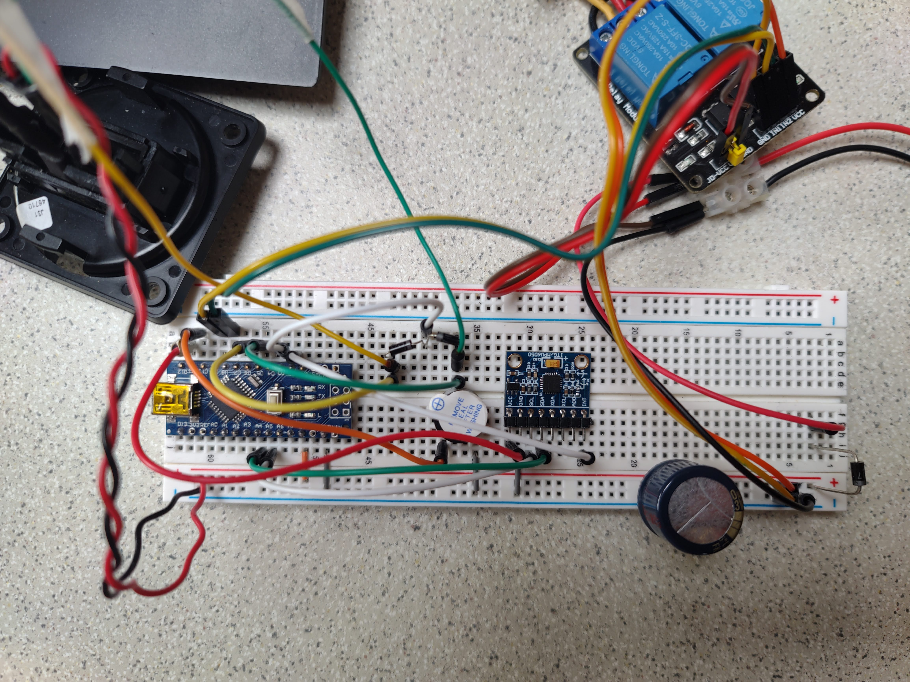
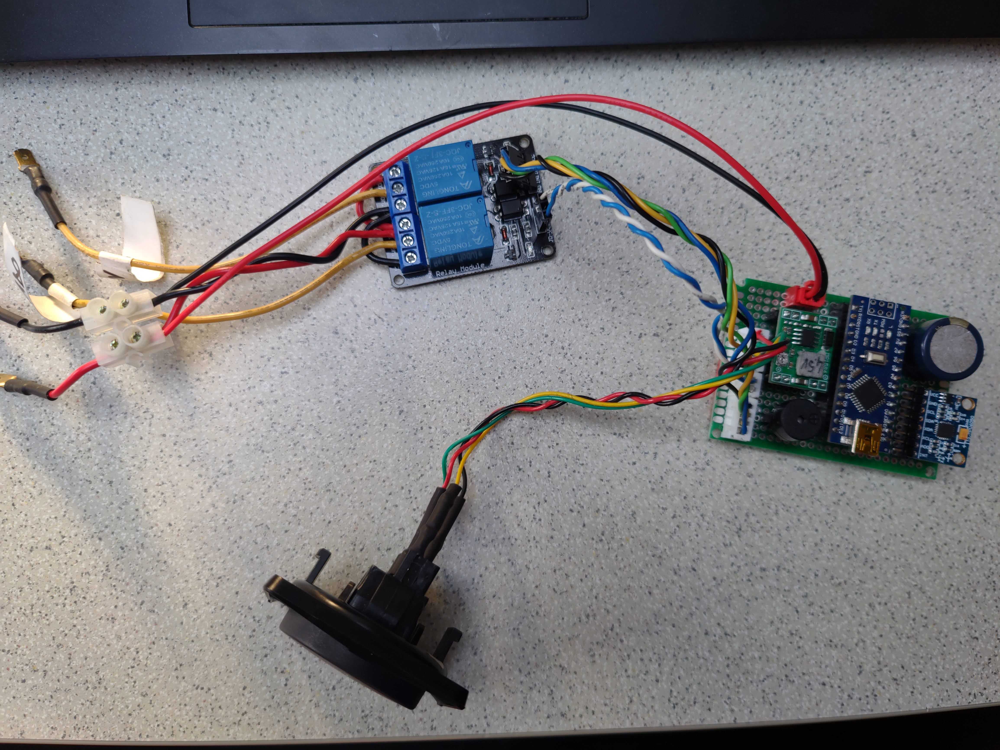
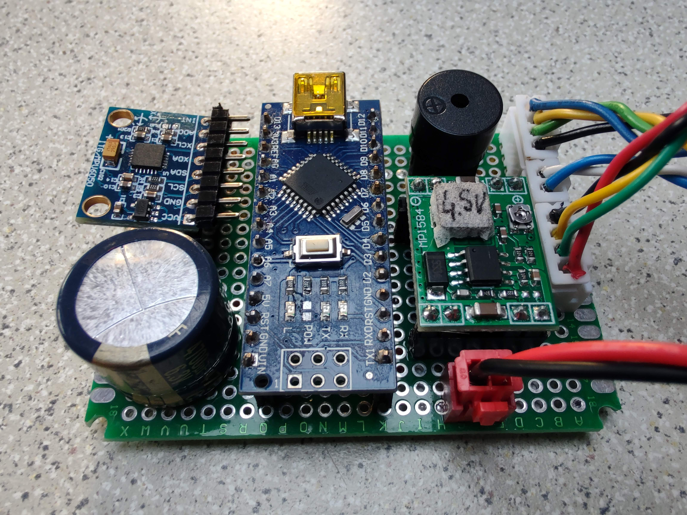
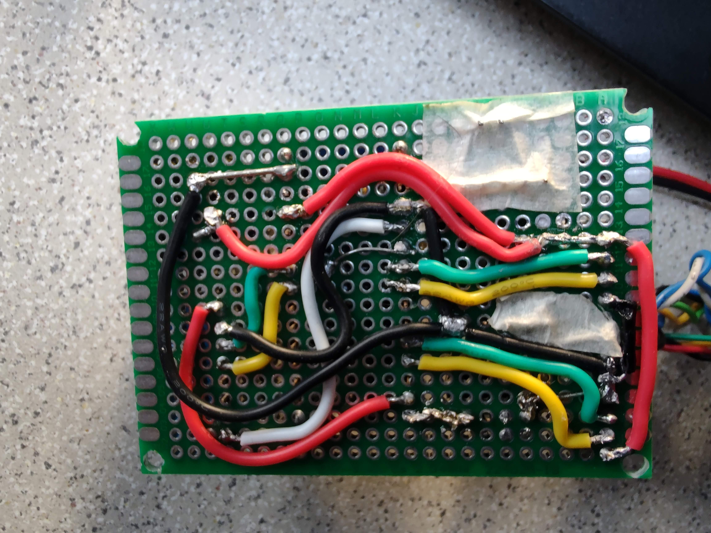
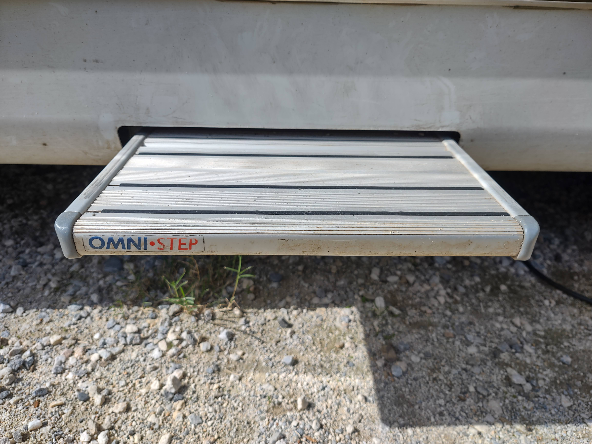
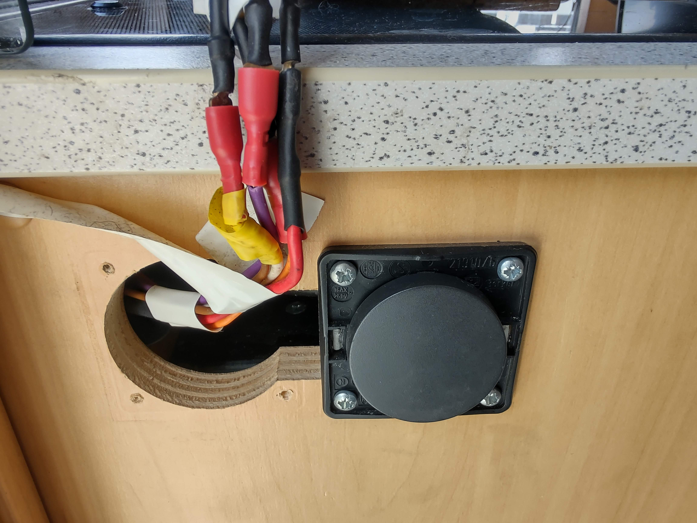

# Replacement for the Step circuit in a vehicle

The circuit is basically a microcontroller + motion detector + relay. So, it can be used for a lot of different projects.

## Instructions
- Understand how your step/device works
- Create the circuit
- Upload the code to the Arduino

### How to use
- slide-out button: to slide out the step
  - the step will auto-slide-in after 11 seconds
  - if the slide-out button is pushed again within 2 seconds after the step has slided out, the auto-slide-in is disabled. This mode is referred as "step slided out in motion detection mode"
- slide in button: to retract the step
- If the vehicle starts moving, an alarm will sound and the step will auto-slide-in
- The step can be controlled by the user and the arduino indistinctly, thanks to the 2x relay configuration

## Bill of materials
- Arduino Nano 3
- 1x switching regulator at 4.5V, 4V after diode.
- 2x relays with NC/NO built-in connectors
- 1x MPU-6050 accelerometer to detect if the vehicle is moving
- 1x Active buzzer to alarm when the vehicle is moving and the step is being auto-slide-in
- 1x 10k resistors for the interrupt
- 3x 1N4007 diodes, 1x to block the current from reaching the regulator when connected to USB, 2x diodes to join the buttons 1 interrupt
- 1x 4700uF capacitor to prevent power drops. Can be much smaller but I liked big

## Low power usage

### current drain idle
| state                                    | powered components                    |   µA | A/year |
| ---------------------------------------- | ------------------------------------- | ---: | -----: |
| off                                      | switch regulator                      |  220 |   1.90 |
| on                                       | switch regulator + Arduino            |  260 |   2.25 |
| step slided out in motion detection mode | switch regulator + Arduino + MPU-6050 |  495 |   4.28 |

### how the power is lowered:

- voltage drop to 4V
  - the relays are running at 4.5V and the diode to protect the circuit when the Arduino is connected to the USB lowers the voltage to 4V
  - the lowest current consumption was at 3.2V but 2 regulators should be used and the diode removed; 1 regulator for the relays + 1 for the arduino
  - instead of a linear regulator
  - removed led
- Arduino:
  - removed power led and regulator (they drain 6mA)
  - pins are all set as INPUT/OUTPUT, because INPUT-PULLUP increases current consumption by 50-80nA per pin
  - default status is deep sleep mode. Wakes up when an interrupt is fired (button pressed or motion detected)
  - speed has been reduced from 16Mhz to 8Mhz. 3.3V requires 8Mhz. Also it consumes a bit less power; but some actions, e.g. programming the MPU, take longer.
- MPU-6050:
  - removed power led. the regulator is still there because the operation voltage range is 2,6-3,4V which is less than the 4V finally choosen
  - is powered up only when the step is permanently slided out, using the internal DMP (Digital Motion Procesor); which does not require the Arduino to poll data and which fires an interruption when motion is detected. Sensibility can be adjusted in the Shared.h file with MOT_DUR_SELECTED and MOT_THR_SELECTED
  - powered off gyros and temp sensor

## possible alternatives/improvements
- Drop voltage to 3.2V. Remove the MPU-6050 regulator. I had stability problems running the circuit below 3.8V and as the circuit is draining 4.28A/year I thought it was not worth to invest more time. Also the voltage prior the main diode must be enought to power up the relays or another regulator is required which will drain much more current. Maybe a zener could be used or a voltage
- Use a SW-420 motion sensor instead of the MPU-6050. I tested it but it is worst option because the SW-420 drains 883µA when idle.
- Use an Arduino Pro Micro
- Use an Arduino Nano 33 IoT
- Use a low power ESP32 based board
- Use a MOSFET to power off the motion detector instead of an Arduino GPIO. Tested before changing to a GPIO

## Useful links

I2Cdev: https://www.i2cdevlib.com/usage
Relay, NPN transistor: https://www.inventable.eu/controlar-rele-con-transistor/
MPU-6050:
  - DMP vs complementary filter: https://www.youtube.com/watch?v=2t-5CCyPJ74&ab_channel=geekmomprojects
  - Promising library: https://github.com/rambo/I2C. I would like to replace I2Cdev and FastWire with it, if i could find more information and would have a lot more energy to spend in this topic

## photos

