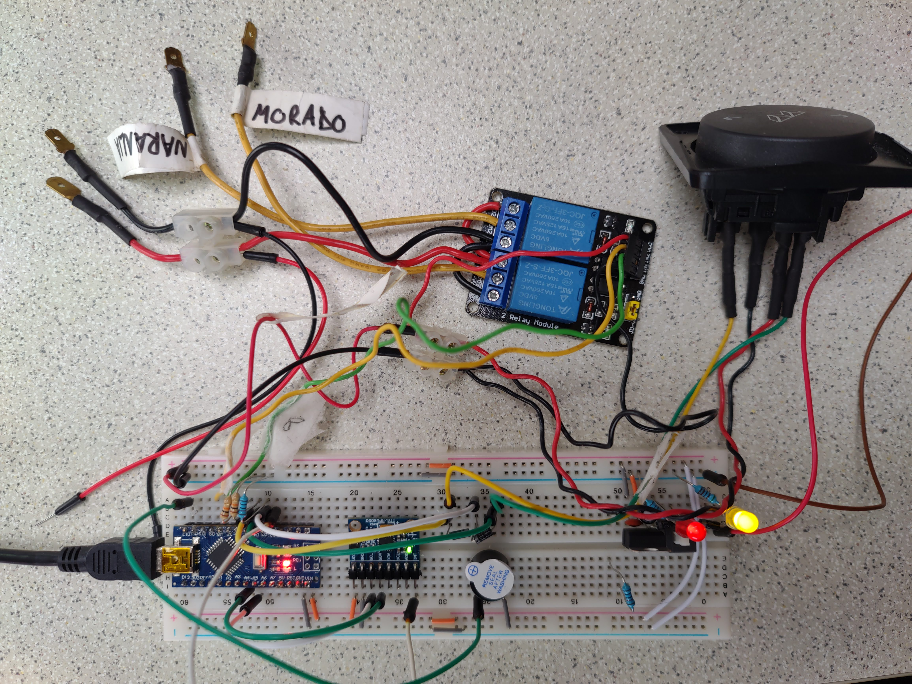

# Replacement for the Step circuit in a vehicle

## Instructions
- Create the circuit
- Upload the code to the Arduino

## Operating instructions
- Open button: to extend the step
  - the step will auto-close after 11 seconds
  - if the Open button is pushed again within 2 seconds after the step has extended, the auto-close is disabled
- Close button: to retract the step
- If the vehicle starts moving, an alarm will sound and the step will auto-close
- The step can be controlled by the user and the arduino indistinctly thanks to the 2x relays

## Bill of materials
- Arduino Nano 3
- 2x relays with NC/NO inbuilt connections to handle direct user input as well as arduino control
- 1x MPU-6050 accelerometer to detect if the vehicle is moving
- 1x Active buzzer to alarm when the vehicle is moving and the step is being auto-closed
- 1x Regulator to 5V to feed the Arduino, the relays and the MPU-6050
- 3x 10k resistances for the buttons and the interrupt of the buttons
- 2x 1N4007 diodes for the interrupt generated by the buttons
- 1x IRF520 MOSFET to power off the motion detector when not needed
- 1x 4700uF capacitor to prevent power drops

## Low power usage
  - Arduino is always in deep sleep mode unless an interrupt is fired or the step is being extended/retracted
  - Interruptions are fires by the buttons and the motion detector
  - The motion detector is power off via MOSFET

## possible improvements
- Use a SW-420 motion sensor instead of the MPU-6050
- Use an Arduino Pro Micro

## Breadboard prototype

